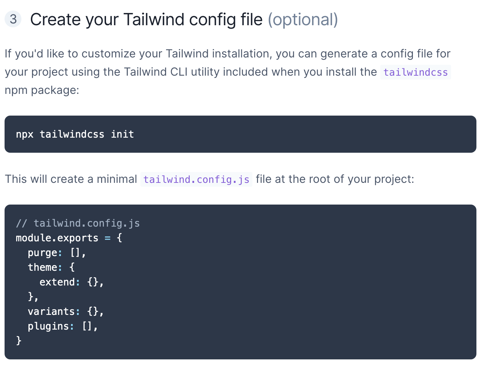

<!-- PROJECT SHIELDS -->

<!-- PROJECT LOGO -->
 

  

  <h3 align="center"><strong>Writer's Block</strong></h3>

  

        A mock of WattPad | Reading & writing webpage
     
    <a href="https://github.com/RachelNapier/writers_block_landing_page"><strong>Explore the docs »</strong></a>
     
    <a href="https://rachelnapier.github.io/writers_block_landing_page/">View Demo</a>
  

<!-- ABOUT -->

## <strong>About This Project:</strong>

A fully responsive mock of Wattpad; a popular story-telling website geared towards imaginitave people whom all share a love for reading and/or writing. With various, features and color themes applied, instead.

<strong>Desktop navigation version:</strong>

 
 

<strong>Mobile navigation version:</strong>

## <strong>Built With:</strong>

This project was built using Tailwindcss, a css framework. containing a series of styles that're directly applied in to the html, loosing the hastle of adding in custom styles to your stylesheets.

- [Tailwindcss](https://tailwindcss.com)

<!-- GETTING STARTED -->

## <strong>Getting Started</strong>

To use this framwork, follow these steps taken directly from the <u>Tailwindcss docs page</u>. ⤵

- For more infromation on the setup, checkout the docs here → [Tailwindcss Documentations](https://tailwindcss.com/docs/installation)

<!-- LICENSE -->

## <strong>Contributors</strong>

Developed by: [<strong>Rachel Napier</strong>](https://github.com/RachelNapier) 
Partial design from: [<strong>Traversy Media</strong>](https://www.youtube.com/channel/UC29ju8bIPH5as8OGnQzwJyA) 
Inspirtation and images from: [<strong>Wattpad</strong>](https://www.wattpad.com/)

<!-- CONTACT -->

## <strong>Contact Me</strong>

Twitter: [@RachelNapier93](https://twitter.com/RachelNapier93) 
Github: [RachelNapier](https://github.com/RachelNapier) 
Gmail: napier.rachel93@gmail.com
